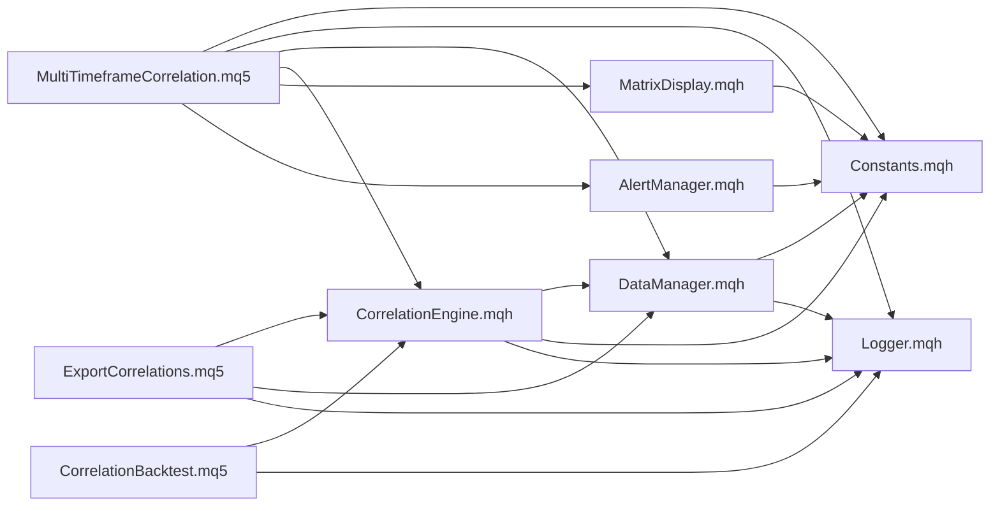
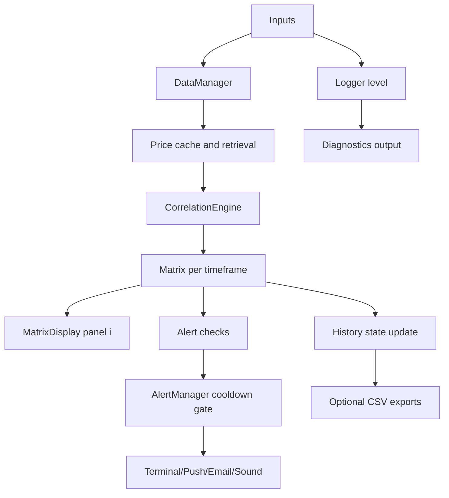

# 04 Structure Diagrams

## Repository Structure

```text
CorreletionMatrix/
├── Include/
│   ├── Constants.mqh
│   ├── Logger.mqh
│   ├── DataManager.mqh
│   ├── CorrelationEngine.mqh
│   ├── MatrixDisplay.mqh
│   └── AlertManager.mqh
├── Indicators/
│   └── MultiTimeframeCorrelation.mq5
├── Scripts/
│   ├── ExportCorrelations.mq5
│   └── CorrelationBacktest.mq5
├── Tests/
│   ├── test_correlation.mq5
│   ├── test_correlation_edge_cases.mq5
│   └── test_data_manager.mq5
├── Docs/
├── install.bat
└── uninstall.bat
```

## Include Dependency Graph



## Runtime Data Flow



## Chart Object Naming Layout

Each panel has unique prefix, e.g. `CORR_0_`, `CORR_1_`, `CORR_2_`.

Objects generated per panel:

- `CORR_i_TITLE`
- `CORR_i_LEGEND`
- `CORR_i_HDR_R_<row>`
- `CORR_i_HDR_C_<col>`
- `CORR_i_CELL_<row>_<col>`
- `CORR_i_LABEL_<row>_<col>`

This avoids collisions across timeframe panels and allows bulk visibility operations per panel prefix.
