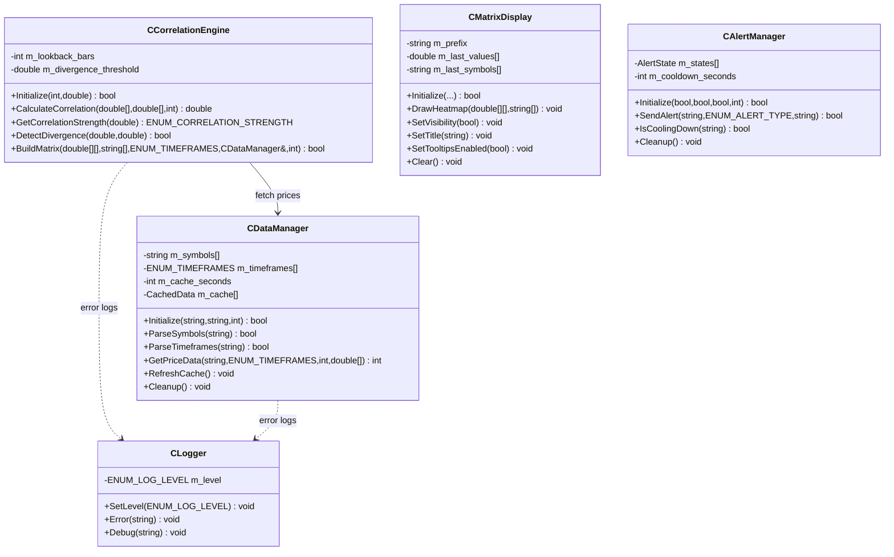
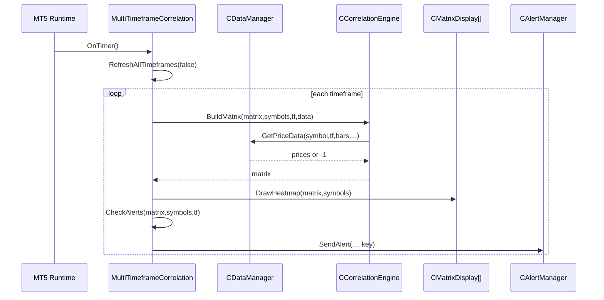
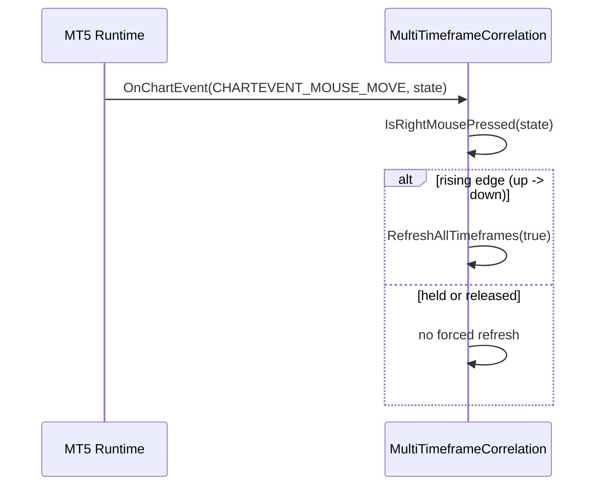
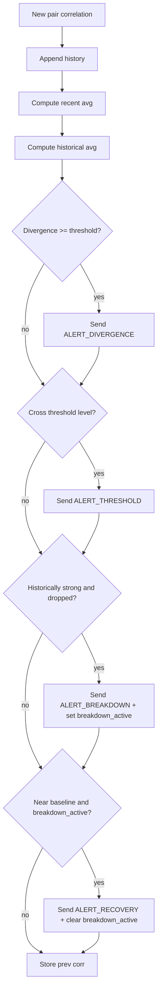

# 03 UML Diagrams

## Class Diagram

```mermaid
classDiagram
    class CCorrelationEngine {
      -int m_lookback_bars
      -double m_divergence_threshold
      +Initialize(int,double) bool
      +CalculateCorrelation(double[],double[],int) double
      +GetCorrelationStrength(double) ENUM_CORRELATION_STRENGTH
      +DetectDivergence(double,double) bool
      +BuildMatrix(double[][],string[],ENUM_TIMEFRAMES,CDataManager&,int) bool
    }

    class CDataManager {
      -string m_symbols[]
      -ENUM_TIMEFRAMES m_timeframes[]
      -int m_cache_seconds
      -CachedData m_cache[]
      +Initialize(string,string,int) bool
      +ParseSymbols(string) bool
      +ParseTimeframes(string) bool
      +GetPriceData(string,ENUM_TIMEFRAMES,int,double[]) int
      +RefreshCache() void
      +Cleanup() void
    }

    class CMatrixDisplay {
      -string m_prefix
      -double m_last_values[]
      -string m_last_symbols[]
      +Initialize(...) bool
      +DrawHeatmap(double[][],string[]) void
      +SetVisibility(bool) void
      +SetTitle(string) void
      +SetTooltipsEnabled(bool) void
      +Clear() void
    }

    class CAlertManager {
      -AlertState m_states[]
      -int m_cooldown_seconds
      +Initialize(bool,bool,bool,int) bool
      +SendAlert(string,ENUM_ALERT_TYPE,string) bool
      +IsCoolingDown(string) bool
      +Cleanup() void
    }

    class CLogger {
      -ENUM_LOG_LEVEL m_level
      +SetLevel(ENUM_LOG_LEVEL) void
      +Error(string) void
      +Debug(string) void
    }

    CCorrelationEngine --> CDataManager : fetch prices
    CCorrelationEngine ..> CLogger : error logs
    CDataManager ..> CLogger : error logs
```

## Sequence Diagram: Timer Refresh

```mermaid
sequenceDiagram
    participant MT5 as MT5 Runtime
    participant I as MultiTimeframeCorrelation
    participant D as CDataManager
    participant E as CCorrelationEngine
    participant V as CMatrixDisplay[]
    participant A as CAlertManager

    MT5->>I: OnTimer()
    I->>I: RefreshAllTimeframes(false)
    loop each timeframe
      I->>E: BuildMatrix(matrix,symbols,tf,data)
      E->>D: GetPriceData(symbol,tf,bars,...)
      D-->>E: prices or -1
      E-->>I: matrix
      I->>V: DrawHeatmap(matrix,symbols)
      I->>I: CheckAlerts(matrix,symbols,tf)
      I->>A: SendAlert(..., key)
    end
```

## Sequence Diagram: Right-Click Refresh

```mermaid
sequenceDiagram
    participant MT5 as MT5 Runtime
    participant I as MultiTimeframeCorrelation

    MT5->>I: OnChartEvent(CHARTEVENT_MOUSE_MOVE, state)
    I->>I: IsRightMousePressed(state)
    alt rising edge (up -> down)
      I->>I: RefreshAllTimeframes(true)
    else held or released
      I->>I: no forced refresh
    end
```

## Activity Diagram: Alert Decision

```mermaid
flowchart TD
    A[New pair correlation] --> B[Append history]
    B --> C[Compute recent avg]
    C --> D[Compute historical avg]
    D --> E{Divergence >= threshold?}
    E -- yes --> E1[Send ALERT_DIVERGENCE]
    E -- no --> F
    E1 --> F{Cross threshold level?}
    F -- yes --> F1[Send ALERT_THRESHOLD]
    F -- no --> G
    F1 --> G{Historically strong and dropped?}
    G -- yes --> G1[Send ALERT_BREAKDOWN + set breakdown_active]
    G -- no --> H
    G1 --> H{Near baseline and breakdown_active?}
    H -- yes --> H1[Send ALERT_RECOVERY + clear breakdown_active]
    H -- no --> I[Store prev corr]
    H1 --> I
```
